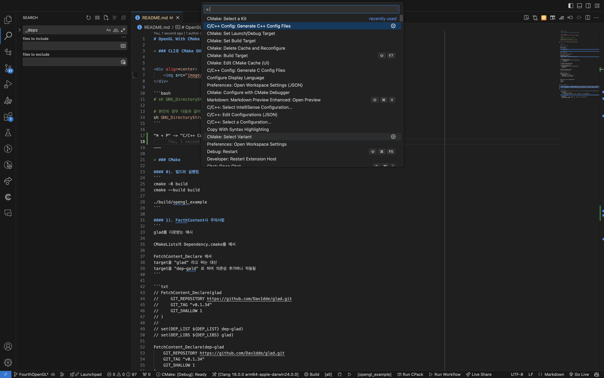
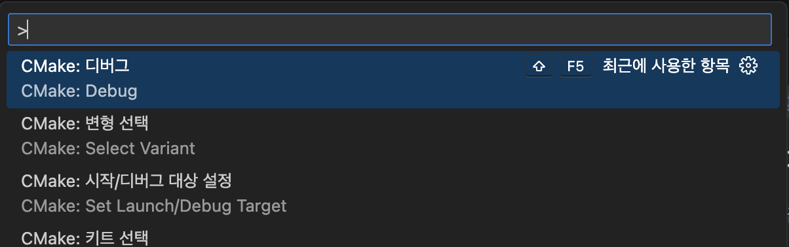

# OpenGL With CMake

> ### CLI로 CMake GNU 파일 제작 Shell 스크립트 실행하기


<div align=center>
    
</div>

```bash
# sh GNU_DirectoryStructure.sh <ProjectName>

# 본인의 경우 다음과 같이 생성함
sh GNU_DirectoryStructure.sh CMAKE_PROJECT_EXAMPLE
```

"⌘ + P" -> "C/C++ Config: Generate C++ Config Files"



---

> ### CMake

#### 0). 빌드와 실행법
```
cmake -B build
cmake --build build

./build/opengl_example
```

#### 1). FecthContent시 주의사항
```
glad를 다운받는 예시

CMakeLists의 Dependency.cmake를 에서 

FetchContent_Declare 에서 
target을 "glad" 라고 하는 대신 
target을 "dep-gald" 로 하여 의존성 추가하니 작동됨
```

```txt
// FetchContent_Declare(glad
//     GIT_REPOSITORY https://github.com/Dav1dde/glad.git
//     GIT_TAG "v0.1.34"
//     GIT_SHALLOW 1
// )
// 
// set(DEP_LIST ${DEP_LIST} dep-glad)
// set(DEP_LIBS ${DEP_LIBS} glad)

FetchContent_Declare(dep-glad
    GIT_REPOSITORY https://github.com/Dav1dde/glad.git
    GIT_TAG "v0.1.34"
    GIT_SHALLOW 1
)

set(DEP_LIST ${DEP_LIST} dep-glad)
set(DEP_LIBS ${DEP_LIBS} glad)
```

#### 2). include 파일 링킹
```
# 타겟 실행파일 정의
add_executable(${PROJECT_NAME} 
    src/main.cpp
    include/common.cpp include/common.h
    include/shader.cpp include/shader.h
)

...

target_include_directories(${PROJECT_NAME}
PUBLIC
    include
PRIVATE 
    src
)
```

#### 3). `CMAKE_ARCS`

> -DGLFW_BUILD_DOCS=OFF 라던가, -DGLAD_INSTALL=ON 등 추가적으로 입력하는 인자는 빌드하고자 하는 외부 프로젝트의 CMakeLists.txt 안을 확인해가면서 찾아야 합니다;;; 외부 프로젝트가 저마다 만듦새가 달라서 (심지어는 stb와 같이 빌드 필요 없이 동작하는 라이브러리도 있지요) 결국 케이스 바이 케이스가 되고 맙니다.
> 예를 들어, GLFW_BUILD_DOCS라는 옵션은, https://github.com/glfw/glfw/blob/master/CMakeLists.txt 여기에 보시면 여러 option() 들 중에 하나로 작성되어 있습니다 ㅎㅎ;

#### 4). CMake 디버깅

디버그 수행시 다음 Working Directory를 설정하지 않으면

"./src", "./app"에서 shader나 image 디렉토리를 찾지 못해
디버깅이 안되는 문제가 생기곤 한다.

```json
/*settings.json*/

...

"cmake.debugConfig": {
    "cwd": "${workspaceFolder}"
},

...
```

그리고 나서



> ### 참고 강의

#### 1). [삼각형의 실전! CMake 초급](https://www.inflearn.com/course/%EC%8B%A4%EC%A0%84-cmake-%EC%B4%88%EA%B8%89/dashboard) 
* 이 강의를 통해 ...
    1. CMake CLI, 
    2. C/C++ 라이브러리 의존성 관리
    3. 모던 CMake의 모듈러 디자인에 대해 이해했고, 확장성 있는 빌드 시스템 작성법을 배웠음

#### 2). [Rinthel Kwon OpenGL course](https://www.youtube.com/watch?v=kEAKvJKnvfA&list=PLvNHCGtd4kh_cYLKMP_E-jwF3YKpDP4hf&ab_channel=RinthelKwon)

* 이 강의를 통해
  1. 삼각형의 CMake 빌드시스템 작성법과 상호 대조해 보며 개발 환경 세팅을 진행했고,
  2. 그래픽스 이론을 학습하기 
