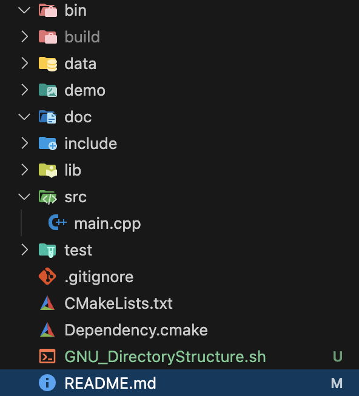

# OpenGL With CMake

> ### CLI로 CMake GNU 파일 제작 Shell 스크립트 실행하기


<div align=center>
    
</div>

```bash
# sh GNU_DirectoryStructure.sh <ProjectName>

# 본인의 경우 다음과 같이 생성함
sh GNU_DirectoryStructure.sh CMAKE_PROJECT_EXAMPLE
```

---

> ### 참고 강의

#### 1). [삼각형의 실전! CMake 초급](https://www.inflearn.com/course/%EC%8B%A4%EC%A0%84-cmake-%EC%B4%88%EA%B8%89/dashboard) 
* 이 강의를 통해 ...
    1. CMake CLI, 
    2. C/C++ 라이브러리 의존성 관리
    3. 모던 CMake의 모듈러 디자인에 대해 이해했고, 확장성 있는 빌드 시스템 작성법을 배웠음

#### 2). [Rinthel Kwon OpenGL course](https://www.youtube.com/watch?v=kEAKvJKnvfA&list=PLvNHCGtd4kh_cYLKMP_E-jwF3YKpDP4hf&ab_channel=RinthelKwon)

* 이 강의를 통해
  1. 삼각형의 CMake 빌드시스템 작성법과 상호 대조해 보며 개발 환경 세팅을 진행했고,
  2. 그래픽스 이론을 학습하기 
