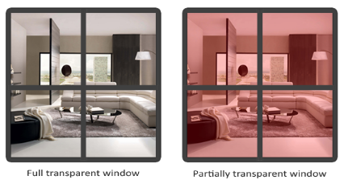

# Framebuffer 입문 — Depth Test 부터

Framebuffer 를 본격적으로 다루기 전, 그 *구성 요소* 중 하나인 **depth buffer** 와 **depth test** 부터 정리한다. 깊이 테스트는 framebuffer 가 단순한 "색 픽셀 배열" 이 아니라 *여러 buffer 의 묶음* 임을 이해하는 가장 자연스러운 입구다.

---

> ### 📄 1. Framebuffer 란 — 여러 buffer 의 묶음

화면에 보이는 한 장의 그림은 사실 *여러 개의 buffer* 가 겹쳐 만들어진다.

| Buffer | 저장하는 것 | 비트 |
|--------|------------|------|
| **Color buffer** | 픽셀의 RGBA 색 | 보통 32-bit (RGBA8) |
| **Depth buffer** | 픽셀의 *깊이값* (카메라로부터의 거리) | 보통 24-bit |
| **Stencil buffer** | 픽셀별 마스크/태그 | 보통 8-bit (depth 와 같이 32-bit 패킹) |

**Default framebuffer** = 윈도우 화면. GLFW 가 윈도우 생성 시 자동 제공.
**FBO (Framebuffer Object)** = 화면 밖(off-screen) 렌더 타겟. 그림자 맵, 포스트 프로세싱 등에 쓰임 — *§7 의 다음 단계*.

`glClear(GL_COLOR_BUFFER_BIT | GL_DEPTH_BUFFER_BIT)` 가 *두 비트* 를 함께 지우는 이유 — color 와 depth 는 *별개 buffer* 이기 때문. 매 프레임 둘 다 초기화해야 한다.

---

> ### 📄 2. Depth Test — 왜 필요한가

depth test 없이 3D 를 그리면, *그리는 순서대로* 색이 덮어써진다 (painter's algorithm). 카메라가 돌면 앞뒤가 뒤바뀌어 *뒤 물체가 앞 물체를 덮는* 깨짐이 생긴다.

**Depth test** = 새 fragment 를 그리기 전, *그 픽셀의 기존 깊이값* 과 *새 fragment 의 깊이값* 을 비교한다. 비교 통과 시에만 color buffer + depth buffer 를 갱신.

```
fragment 생성 → depth 비교 (glDepthFunc 기준) → 통과? → color/depth 기록
                                              → 실패? → fragment 폐기
```

→ 그리는 순서와 무관하게 *항상 카메라에 가까운 면이 보인다*.

---

> ### 📄 3. Depth 관련 GL 호출 — 프로젝트 매핑

[context.cpp](../../src/context/context.cpp) 의 depth 관련 호출:

| GL 호출 | 역할 | 프로젝트 위치 |
|---------|------|--------------|
| `glEnable(GL_DEPTH_TEST)` | depth test *켜기* — 끄면 painter's algorithm 으로 회귀 | [context.cpp Render](../../src/context/context.cpp) |
| `glDisable(GL_DEPTH_TEST)` | depth test *끄기* — §6 참조 | (주석 처리) |
| `glClear(GL_DEPTH_BUFFER_BIT)` | depth buffer 를 `glClearDepth` 값으로 초기화 | `Render()` 매 프레임 첫줄 |
| `glClearDepth(1.0f)` | clear 시 채울 깊이값 — 기본 1.0 (= 가장 멀리) | (주석 — 기본값 사용) |
| `glDepthFunc(func)` | depth *비교 연산자* 선택 (§4) | `Render()` — ImGui Combo 가 고른 값 |
| `glDepthMask(GL_FALSE)` | depth buffer *쓰기 막기* — 테스트는 하되 기록 안 함 (반투명 렌더 등) | (주석 처리) |

> **State-setting** 함수들이다 ([GLState.md](GLState.md) §1) — 한 번 호출하면 다음 draw 들이 그 상태를 본다.
> `glEnable(GL_DEPTH_TEST)` 는 *글로벌* 컨텍스트 상태.

---

> ### 📄 4. Depth 비교 연산자 — `glDepthFunc`

깊이값 범위는 `[0, 1]` — **0 = 가장 가까움, 1 = 가장 멀리**. `glDepthFunc` 는 "새 fragment 가 *어떤 조건* 일 때 통과시킬지" 를 정한다.

| 인덱스 | 값 | 의미 |
|--------|-----|------|
| 0 | `GL_ALWAYS` | 항상 통과 (depth test 무력화 효과) |
| 1 | `GL_NEVER` | 항상 실패 (아무것도 안 그려짐) |
| 2 | `GL_LESS` | 새 깊이 < 기존 → 통과 *(기본값)* — 더 가까우면 그림 |
| 3 | `GL_LEQUAL` | 같거나 가까우면 통과 |
| 4 | `GL_GREATER` | 더 멀면 통과 |
| 5 | `GL_GEQUAL` | 같거나 멀면 통과 |
| 6 | `GL_EQUAL` | 깊이가 정확히 같을 때만 |
| 7 | `GL_NOTEQUAL` | 깊이가 다를 때만 |

기본값 `GL_LESS` — "1(가장 멀리)보다 더 작은(가까운) 것을 통과시킨다". 즉 *가까운 면이 이긴다*.

> 프로젝트는 이 8개를 ImGui Combo 로 런타임 전환 가능하게 해둠 — `DEPTH_FUNC_LABELS[]` (라벨) 와 `DEPTH_FUNC[]` (GL enum) 의 *인덱스 순서가 1:1 동일* 해야 한다. 둘 중 하나만 바뀌면 라벨과 실제 동작이 어긋남.

---

> ### 📄 5. Depth 값의 비선형 분포 — z-fighting

Perspective projection 은 깊이값을 `[0, 1]` 로 정규화하면서 `w` 로 나눈다. 그 결과 정규화된 z 는 **`1/z` 꼴** 로 분포 — *가까운 곳은 정밀, 먼 곳은 듬성듬성*.

```
실제 거리:  near ──────────────────────────── far
정규화 z :  0   0.5  0.8  0.9 0.95 ......... 1.0
            ↑ 가까운 쪽에 정밀도 집중      ↑ 먼 쪽은 값 차이 미미
```

### z-fighting

먼 거리의 두 면은 정규화 z 값이 *거의 같아* — depth test 가 어느 게 앞인지 판정 못 해 픽셀이 *깜빡이며 다투는* 현상.

**예방** (context.cpp 주석에서):
- 면과 면을 *너무 가깝게 겹치지* 않기.
- `near` 평면을 *너무 작게* 잡지 않기 — near 가 작을수록 `1/z` 곡선이 가팔라져 먼 쪽 정밀도가 더 망가짐.
- 더 정밀한 depth buffer (24→32-bit) 사용.

> [Camera::GetProjMatrix](../../src/object/camera.h) 의 `NearPlane` / `FarPlane` 가 이 분포를 결정. `NearPlane` 을 0.001 같이 극단적으로 작게 두면 먼 물체가 z-fighting 에 취약해진다.

---

> ### 📄 6. Depth Test 를 *끄는* 경우

`glEnable(GL_DEPTH_TEST)` 가 기본이지만, *의도적으로 꺼야* 하는 상황이 있다 — depth 와 무관하게 *항상 앞* 또는 *항상 뒤* 로 그려야 할 때.

| 상황 | 이유 |
|------|------|
| **ImGui / HUD / UI** | UI 는 3D 씬 *위에 항상* 떠야 함. depth 비교 대상이 아님 — 그래서 ImGui 렌더 구간은 depth test off |
| **Skybox** | 항상 *가장 뒤* — `GL_LEQUAL` + depth=1.0 트릭 또는 test off |
| **반투명 (blend) 객체** | depth *test* 는 하되 *write* 는 막음 (`glDepthMask(GL_FALSE)`) — 뒤 객체가 비쳐 보이도록 |

> 프로젝트 주석: *"Depth Test 를 꺼야 하는 상황은? → ImGui 를 사용할 때."* 정확하다. UI 는 3D 깊이 순서와 별개 레이어.

---

> ### 📄 7. 다음 단계 — Framebuffer Object (FBO)

여기까지가 *default framebuffer* (윈도우 화면) + depth buffer 의 기초. 본격적인 framebuffer 학습은 **off-screen 렌더링**:

```
씬을 화면이 아닌 *내가 만든 FBO* 에 그림
  → 그 결과(color/depth)를 텍스처로 받음
  → 그 텍스처를 다시 화면에 그리거나 후처리
```

활용 예:
- **그림자 맵** — light 시점에서 depth 만 FBO 에 렌더 → 그 depth 텍스처로 그림자 판정
- **포스트 프로세싱** — 씬을 FBO 텍스처로 받아 blur / bloom / tone-mapping
- **mirror / portal** — 다른 시점 렌더를 텍스처로

핵심 GL 객체: `glGenFramebuffers` / `glBindFramebuffer` / `glFramebufferTexture2D` / `glCheckFramebufferStatus`.

> depth test 가 *default framebuffer 의 depth buffer* 를 다뤘다면, FBO 단계에선 *내가 depth attachment 를 직접 만들어 붙인다*. depth buffer 가 "자동으로 거기 있는 것" 이 아니라 *framebuffer 의 한 attachment* 임을 그때 체감하게 된다.

---

> ### 📄 참고

- GL state-setting / state-using 구분: [GLState.md](GLState.md)
- depth 관련 호출은 모두 state-setting — 호출 순서가 결과를 좌우.
- 프로젝트 코드: [context.cpp](../../src/context/context.cpp) `Render()` 의 `glClear` / `glEnable(GL_DEPTH_TEST)` / `glDepthFunc`.

---

> ### 📄 8. Stencil Test — Depth 와 무엇이 다른가

depth buffer 다음으로 만나는 framebuffer 의 또 한 attachment 가 **stencil buffer**. 이름이 비슷해 헷갈리지만 *완전히 다른 일* 을 한다.

> 🎨 **Photoshop 비유**
> - **Depth buffer** = 레이어의 *앞뒤 순서* 를 픽셀 단위로 GPU 가 *자동* 판정해 주는 것. "이 픽셀에선 어느 레이어가 위인가?"
> - **Stencil buffer** = *선택 영역(마퀴 / 레이어 마스크)*. "여기는 칠해도 되는 영역, 여기는 안 되는 영역" 을 흑백 도장처럼 찍어 두는 것.
>
> Photoshop 에서 *선택 영역을 만든 뒤 그 안에만 붓질* 하는 것 — 그게 stencil 의 핵심 동작이다.

### 8.1 자료형부터 다르다

| | **Depth Test** | **Stencil Test** |
|---|---|---|
| 픽셀당 저장 자료형 | `float` `[0,1]` — *거리* | `integer` 8-bit `0~255` — *태그/마스크 번호* |
| 값을 누가 쓰나 | GPU 가 fragment 의 z 를 **자동** 기록 | 개발자가 `glStencilOp` 로 **무슨 값 쓸지 직접 지정** |
| 비교하는 것 | 새 fragment z `vs` 기존 z | 새 fragment 의 `ref` `vs` 기존 stencil 값 |
| 고유 작업 (대체 불가) | **가림 판정** — 누가 더 앞인가 | **영역 마스킹** — 어디에 그릴/안 그릴 것인가 |
| 존재 이유 | 3D 깊이 정렬을 *자동화* | *임의의 픽셀 영역* 을 표시해 후속 렌더를 그 영역으로 제한 |

### 8.2 서로 대체 불가능한 이유

- **Depth 로는 "이 모양 안쪽만" 같은 임의 영역 마스킹을 못 한다.** depth 는 *거리* 만 안다 — 모양 개념이 없다.
- **Stencil 로는 "누가 더 가까운가" 판정을 못 한다.** stencil 은 *거리* 개념이 없다 — 그냥 정수 도장일 뿐.

→ 둘은 *겹치지 않는 책임* 을 가진 별개 buffer. framebuffer 가 "여러 buffer 의 묶음" (§1) 인 이유가 여기서 또 한 번 드러난다.

> 🎨 **Photoshop 비유** — Depth 는 *레이어 패널의 위아래 순서*, Stencil 은 *레이어 마스크*. 순서를 바꾼다고 마스크가 생기지 않고, 마스크를 칠한다고 순서가 바뀌지 않는다. 둘 다 필요하다.

---

> ### 📄 9. Stencil 핵심 함수 3종

| 함수 | 역할 | Photoshop 비유 🎨 |
|------|------|------------------|
| `glStencilFunc(func, ref, mask)` | stencil **테스트 조건** — `(ref & mask)` 와 `(저장값 & mask)` 를 `func` 로 비교 | "이 선택 영역 *안* 픽셀만 통과" 조건 설정 |
| `glStencilOp(sfail, dpfail, dppass)` | 테스트 **결과별로 stencil 값을 어떻게 바꿀지** | 붓질이 닿은 자리에 *마스크 도장* 을 어떻게 찍을지 |
| `glStencilMask(mask)` | stencil buffer **쓰기 비트 마스크** — `0x00` 이면 *쓰기 잠금* | 마스크 레이어 자체를 *수정 잠금* 할지 |

### `glStencilOp(sfail, dpfail, dppass)` — 3가지 결과 분기

| 인자 | 언제 동작 |
|------|----------|
| `sfail` | stencil test *실패* |
| `dpfail` | stencil 통과했지만 depth test *실패* |
| `dppass` | stencil + depth **둘 다 통과** |

가능한 동작 값:

| 값 | 의미 |
|----|------|
| `GL_KEEP` | 현재 stencil 값 유지 (기본) |
| `GL_ZERO` | 0 으로 |
| `GL_REPLACE` | `glStencilFunc` 의 `ref` 값으로 교체 |
| `GL_INVERT` | bitwise 반전 (`0x0F`→`0xF0`) |
| `GL_INCR` / `GL_DECR` | ±1 (한계값에서 멈춤) |
| `GL_INCR_WRAP` / `GL_DECR_WRAP` | ±1 (한계값에서 wrap) |

---

> ### 📄 10. 예제 — Object Outlining (오브젝트 외곽선)

stencil 의 대표 활용. *오브젝트를 그릴 때 그 자리에 도장을 찍어두고*, *살짝 키운 외곽선 셰이더로 다시 그리되 도장 안 찍힌 자리에만* 그리면 — 테두리만 남는다.

> 🎨 **Photoshop 비유** — ① 도형을 그린다 → ② 그 도형으로 *선택 영역* 을 만든다 → ③ *선택 영역 확장* → ④ 확장된 영역에서 *원래 도형을 빼면* 테두리 링만 남는다. stencil outline 이 정확히 이 절차다.

### 이론 6단계 ↔ 코드 1:1 대응

```cpp
// ── 1. stencil buffer 를 0 으로 클리어 ──────────────────────────────
//    🎨 선택 영역을 "아무것도 선택 안 됨" 으로 리셋
glClear(GL_COLOR_BUFFER_BIT | GL_DEPTH_BUFFER_BIT | GL_STENCIL_BUFFER_BIT);
glEnable(GL_STENCIL_TEST);

// ── 2. 오브젝트가 그려진 자리에 stencil=1 도장 ──────────────────────
//    test 는 항상 통과(GL_ALWAYS), 통과한 픽셀의 stencil 을 ref(=1) 로 교체.
//    🎨 도형을 그리면서 동시에 그 모양대로 선택 영역을 만든다
glStencilFunc(GL_ALWAYS, 1, 0xFF);          // 항상 통과, ref=1
glStencilOp(GL_KEEP, GL_KEEP, GL_REPLACE);  // dppass 시 stencil ← 1
glStencilMask(0xFF);                         // stencil 쓰기 허용
DrawObject(normalShader);                    // 일반 셰이더로 본체 렌더

// ── 3. depth test off + stencil 쓰기 잠금 ──────────────────────────
//    외곽선이 본체에 *가려지지 않도록* depth off.
//    이제부터 stencil 은 *읽기만* — 도장을 더 안 찍는다.
//    🎨 선택 영역을 "수정 잠금" 하고, 레이어 순서 무시하고 위에 덧칠 준비
glDisable(GL_DEPTH_TEST);
glStencilMask(0x00);                         // stencil 쓰기 잠금

// ── 4. 오브젝트를 살짝 키우고, 외곽선 전용 셰이더로 ─────────────────
//    🎨 선택 영역을 확장(Expand) — 키운 만큼이 테두리 두께가 된다
glm::mat4 scaledUp = glm::scale(modelMatrix, glm::vec3(1.1f));

// ── 5. stencil != 1 인 픽셀에만 그림 ───────────────────────────────
//    GL_NOTEQUAL: 저장값이 ref(1) 와 *다른* 곳만 통과.
//    = 본체가 찍어둔 1 영역은 건너뛰고, *키워서 삐져나온 가장자리* 만 칠함.
//    🎨 "확장 영역에서 원래 도형을 뺀다" → 테두리 링만 남음
glStencilFunc(GL_NOTEQUAL, 1, 0xFF);
DrawObject(outlineShader, scaledUp);         // 단색 외곽선 셰이더

// ── 6. 원상복구 — depth test 재활성 + stencil 쓰기 복원 ────────────
glEnable(GL_DEPTH_TEST);
glStencilMask(0xFF);
glStencilFunc(GL_ALWAYS, 1, 0xFF);           // 다음 프레임 위해 기본값으로
```

### 왜 이렇게 동작하나 — 한 문장씩

| 단계 | 핵심 | 🎨 Photoshop 으로 |
|------|------|------------------|
| 1 | 마스크를 빈 상태로 | 선택 해제 |
| 2 | 본체를 그리며 그 모양 = stencil 1 영역 | 도형 그리기 + 같은 모양 선택 영역 생성 |
| 3 | depth off → 외곽선이 본체 뒤로 안 숨음 / stencil 잠금 | 마스크 잠금 + 레이어 순서 무시 |
| 4 | 1.1배 확대 | 선택 영역 확장 |
| 5 | `NOTEQUAL 1` → 본체 영역 *제외*, 삐져나온 테두리만 | 확장 영역 − 원본 도형 = 테두리 링 |
| 6 | 상태 원복 | 작업 끝 — 도구 정리 |

### 핵심 직관

> outline 의 본질 = **"키운 모양"에서 "원래 모양"을 뺀 차집합**.
> stencil buffer 가 그 *"원래 모양"* 을 기억하는 도구다. depth buffer 로는 절대 못 한다 — 모양을 기억하는 건 stencil 의 고유 능력 (§8.2).

---

> ### 📄 참고 — Stencil

- 본 프로젝트 [context.cpp](../../src/context/context.cpp) `Render()` 의 stencil 블록은 *학습용 골격* — `glEnable(GL_STENCIL_TEST)` + `glStencilFunc` 까지만, `glStencilOp` 와 실제 outline 렌더는 주석. 위 6단계가 완성형.
- stencil buffer 를 쓰려면 *framebuffer 에 stencil attachment 가 있어야* 한다. GLFW default framebuffer 는 보통 `GLFW_DEPTH_BITS`/`GLFW_STENCIL_BITS` 힌트로 24+8 packed 를 제공 — 별도 설정 없이 대개 사용 가능.
- `glClear` 시 `GL_STENCIL_BUFFER_BIT` 를 빠뜨리면 — 이전 프레임 도장이 남아 outline 이 깨진다 (depth 의 `GL_DEPTH_BUFFER_BIT` 와 같은 규칙).

---

> ### 📄 블렌딩



#### 블랜딩 활성화

`glEnable(GL_BLEND);`

#### 블랜딩 함수
`glBlendFunc(GL_SRC_ALPHA, GL_ONE_MINUS_SRC_ALPHA);`

#### 블렌딩 숫식


$$
C_{result} = (C_{source} * F_{source}) + (C_{destination} * F_{destination})
$$

* `glBlendFunc`으로 `F` 값을 설정할 수 있음
* `glBlendEquation`으로 가운데 `+` 연산자 설정 가능

```
GL_ZERO, GL_ONE
GL_SRC_COLOR, GL_SRC_ALPHA
GL_ONE_MINUS_SRC_COLOR, GL_ONE_MINUS_SRC_ALPHA
GL_DST_COLOR, GL_DST_ALPHA
GL_ONE_MINUS_DST_COLOR, GL_ONE_MINUS_DST_ALPHA
GL_CONSTANT_COLOR, GL_CONSTANT_ALPHA
GL_ONE_MINUS_CONSTANT_COLOR, GL_ONE_MINUS_CONSTANT_ALPHA
```


#### 알파, Color 분리 함수
`glBlendFuncSeparate` 
* color / alpha 별로 별도의 수식 적용 가능
```
GL_FUNC_ADD: src + dst
GL_FUNC_SUBTRACT: src - dst
GL_FUNC_REVERSE_SUBTRACT: dst - src
GL_MIN: min(src, dst)
GL_MAX: max(src, dst)
```
